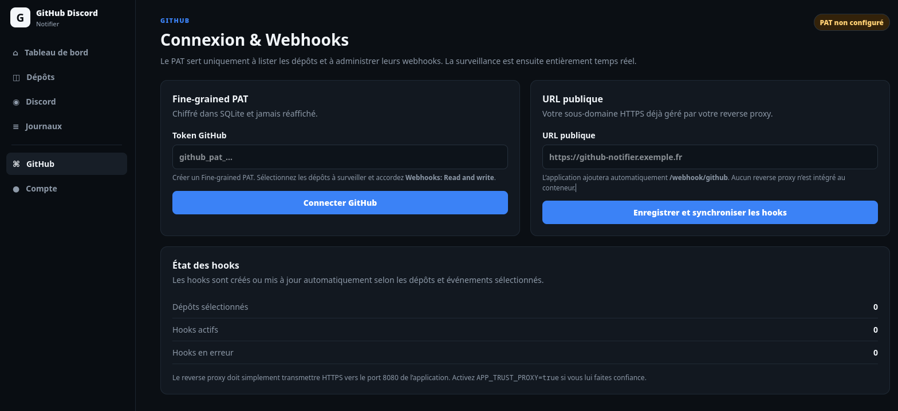
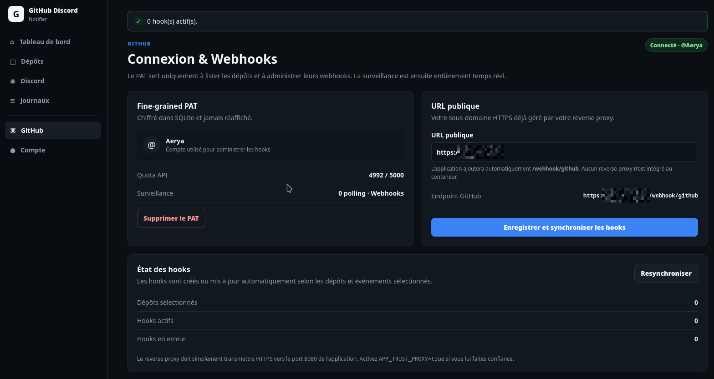
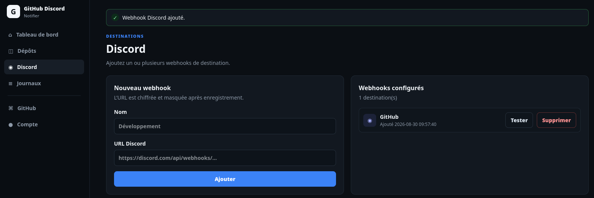
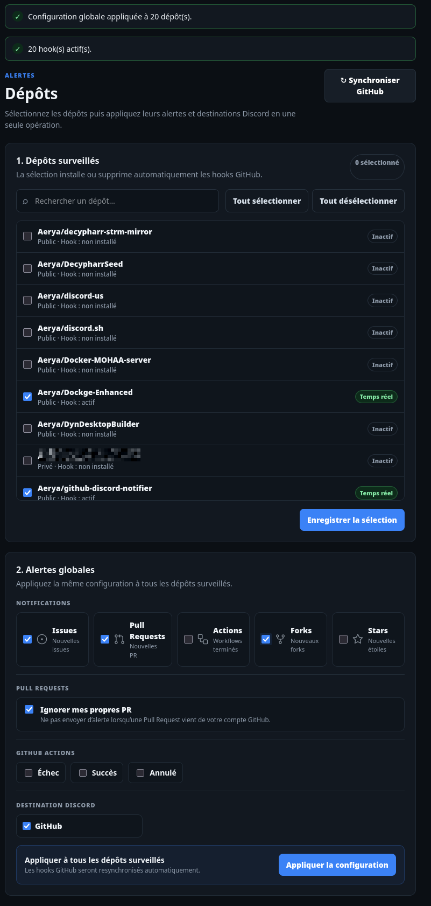
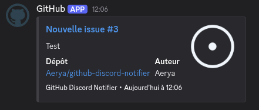
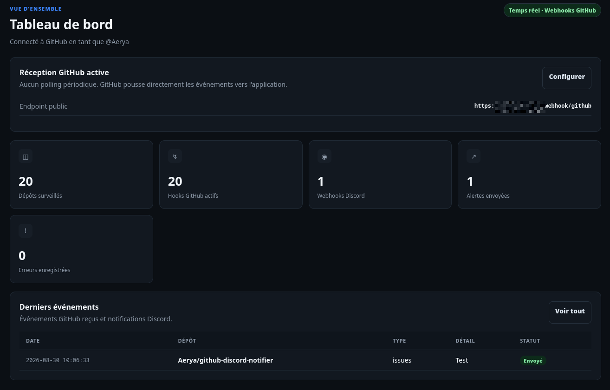
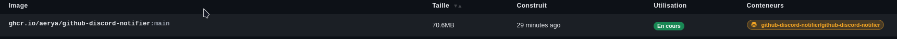

# GitHub Discord Notifier

Service Docker self-hosted qui reçoit les événements GitHub en temps réel et les envoie vers Discord.

## Fonctionnement

GitHub Discord Notifier fonctionne en **webhooks entrants** :

```text
GitHub
  │
  │ webhook HTTPS
  ▼
Reverse proxy existant
  │
  ▼
GitHub Discord Notifier :8080
  │
  └── /webhook/github
          │
          ▼
       Discord
```

GitHub pousse directement chaque événement vers l'application dès qu'il se produit.

L'application doit utiliser un reverse proxy HTTPS type Nginx Proxy Manager, Traefik, Caddy, Cloudflare Tunnel...

## Fonctionnalités

- WebUI entièrement en français
- Authentification locale
- Fine-grained PAT GitHub chiffré dans SQLite
- Synchronisation de la liste des dépôts accessibles
- Sélection globale des dépôts
- Installation automatique des webhooks GitHub sur les dépôts sélectionnés
- Mise à jour automatique des hooks lorsque les alertes changent
- Suppression du hook lorsqu'un dépôt n'est plus surveillé
- Aucun polling GitHub
- Notifications Discord quasi instantanées
- Plusieurs webhooks Discord
- Alertes :
  - nouvelles Issues
  - nouvelles Pull Requests
  - GitHub Actions terminées
  - forks
  - stars
- Filtres Actions : échec, succès, annulation
- Option pour ignorer ses propres PR
- Octicons GitHub officiels dans la WebUI et les notifications Discord
- Titres Discord cliquables vers l'Issue, la PR, le workflow ou le dépôt concerné
- Nom du dépôt cliquable vers GitHub
- Journaux des envois, erreurs et événements ignorés

## Captures d'écran

<p align="center">
  <a href="docs/screens/1.png"></a>
  <a href="docs/screens/2.png"></a>
  <a href="docs/screens/3.png"></a>
  <a href="docs/screens/4.png"></a>
  <a href="docs/screens/5.png"></a>
  <a href="docs/screens/6.png"></a>
  <a href="docs/screens/7.png"></a>
</p>

> Cliquez sur une capture pour l'afficher en taille réelle.

## Prérequis

- Docker / Docker Compose.
- Un sous-domaine HTTPS pointant vers votre reverse proxy
- Le reverse proxy doit transférer le trafic vers le port `8080` du conteneur
- Un webhook Discord
- Un Fine-grained Personal Access Token GitHub

## Fine-grained PAT GitHub

Créez un **[Fine-grained Personal Access Token](https://github.com/settings/personal-access-tokens/new)**.

1. Sélectionnez les dépôts que vous souhaitez surveiller.
2. Dans **Repository permissions**, accordez :
   - **Webhooks: Read and write**.
3. Générez le token.
4. Collez-le dans **GitHub** dans la WebUI.

Le PAT sert uniquement à :
- récupérer la liste des dépôts ;
- créer, modifier et supprimer les webhooks GitHub.

Il n'est pas utilisé pour scanner périodiquement les dépôts.

## Sécurité des webhooks GitHub

Chaque livraison GitHub est vérifiée grâce à la signature :

```text
X-Hub-Signature-256
```

L'application calcule la signature HMAC SHA-256 avec le secret enregistré et rejette toute livraison invalide.

L'endpoint `/webhook/github` est public par nécessité, mais il n'accepte pas les requêtes non signées correctement.

La WebUI reste protégée par l'authentification locale.

## Événements GitHub utilisés

Selon la configuration de chaque dépôt, l'application demande uniquement les événements nécessaires :

- `issues`
- `pull_request`
- `workflow_run`
- `fork`
- `star`

Pour `issues` et `pull_request`, seules les créations sont notifiées.

Pour `workflow_run`, seules les exécutions terminées correspondant aux statuts sélectionnés sont notifiées.

Pour `star`, seule l'action `created` est notifiée.

## Journaux

Les journaux indiquent notamment :
- hook GitHub installé ou en erreur
- livraison webhook reçue
- signature invalide
- événement ignoré par configuration
- notification Discord envoyée
- erreur Discord détaillée

## Sécurité
- mots de passe locaux hashés avec Argon2id
- PAT GitHub chiffré dans SQLite
- secret webhook GitHub chiffré
- webhooks Discord chiffrés
- vérification HMAC SHA-256 des livraisons GitHub
- protection CSRF de la WebUI
- cookies `HttpOnly` et `SameSite=Lax`
- CSP et anti-framing
- aucun secret écrit dans les journaux

## Licence

MIT
